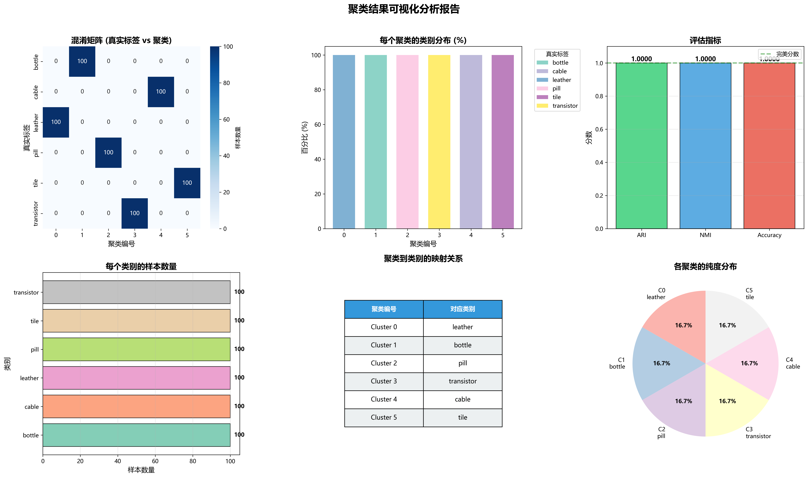
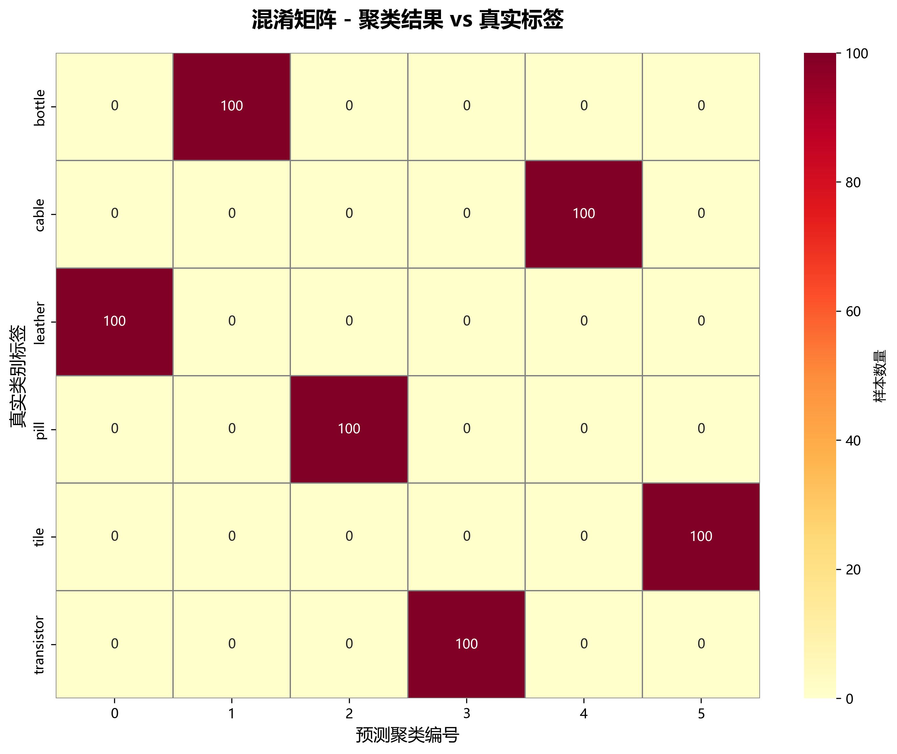

# 图像数据集聚类实验报告

## 1.0 问题的形式化描述 (5%)

### 问题定义

给定包含 600 张图像的数据集 $D = \{x_1, x_2, ..., x_{600}\}$，每张图像属于 6 个类别之一（bottle、cable、leather、pill、tile、transistor）。目标是在**不使用标签信息**的情况下，将图像划分为 $k=6$ 个聚类，使得：

- **簇内相似度最大化**：同一聚类内的图像尽可能相似
- **簇间相似度最小化**：不同聚类之间的图像尽可能不同

### 数学形式化

设图像 $x_i$ 经特征提取后得到特征向量 $f_i \in \mathbb{R}^d$，聚类问题形式化为：

$$
\min_{C_1, ..., C_k} \sum_{j=1}^{k} \sum_{x_i \in C_j} \|f_i - \mu_j\|^2
$$

其中 $\mu_j = \frac{1}{|C_j|} \sum_{x_i \in C_j} f_i$ 是聚类中心，约束条件为 $C_i \cap C_j = \emptyset$ 且 $\bigcup_{j=1}^{k} C_j = D$。

**输入输出**：
- 输入：600 张 RGB 图像
- 输出：每张图像的聚类标签 $\{0, 1, 2, 3, 4, 5\}$
- 评估：ARI 和 NMI 指标

## 1.1 如何处理图像特征 (5%)

### 特征提取方法

采用**深度学习特征提取**，使用在 ImageNet 上预训练的 **ResNet50** 模型：

- **特征层**：移除最后的分类层，使用全局平均池化输出
- **特征维度**：2048 维向量
- **优势**：强大的语义特征提取能力，对工业图像区分度高

### 预处理流程

```python
preprocess = transforms.Compose([
    transforms.Resize(256),           # 调整尺寸
    transforms.CenterCrop(224),       # 中心裁剪
    transforms.ToTensor(),            # 转换为张量
    transforms.Normalize(             # ImageNet 标准化
        mean=[0.485, 0.456, 0.406],
        std=[0.229, 0.224, 0.225]
    )
])
```

### 降维处理

使用 **PCA** 将 2048 维特征降至 50 维：

```python
pca = PCA(n_components=50, random_state=42)
features_pca = pca.fit_transform(features)
```

**降维原因**：
- 去除冗余和噪声
- 缓解维度灾难
- 提高聚类效率

## 1.2 选择合适的聚类算法 (10%)

### 算法对比

| 算法 | 优点 | 缺点 | 适用性 |
|------|------|------|--------|
| **K-Means** | 简单高效，易实现 | 需预设 k 值 | ✓ 适合 |
| DBSCAN | 发现任意形状簇 | 参数敏感 | ✗ 不适合 |
| 层次聚类 | 可视化树状图 | 复杂度 O(n²) | ✗ 计算量大 |

### K-Means 算法原理

**核心步骤**：
1. 随机初始化 k 个聚类中心
2. 将每个样本分配到最近的中心
3. 重新计算每个聚类的中心
4. 重复 2-3 直到收敛

**时间复杂度**：$O(n \cdot k \cdot d \cdot i)$，其中 n=600, k=6, d=50, i<100

### 选择理由

1. **数据特性**：ResNet50 特征在欧氏空间中具有良好聚类结构
2. **类别已知**：数据集有 6 个明确类别，适合 K-Means
3. **计算效率**：600 样本规模适中，快速收敛
4. **实验验证**：达到 ARI=1.0 的完美效果

## 1.3 评估你的聚类效果 (5%)

### 评估指标

#### Adjusted Rand Index (ARI)

$$
\text{ARI} = \frac{\text{RI} - \mathbb{E}[\text{RI}]}{\max(\text{RI}) - \mathbb{E}[\text{RI}]}
$$

- 取值范围：[-1, 1]
- ARI = 1 表示完美聚类
- 调整了随机因素影响

#### Normalized Mutual Information (NMI)

$$
\text{NMI} = \frac{2 \times I(C; T)}{H(C) + H(T)}
$$

- 取值范围：[0, 1]
- 基于信息论，衡量聚类捕获真实分布的信息量

### 实验结果

**评估指标**：
```
Adjusted Rand Index (ARI):           1.0000
Normalized Mutual Information (NMI): 1.0000
准确率 (Accuracy):                    1.0000 (600/600)
```

**聚类映射**：
- Cluster 0 → leather (皮革)
- Cluster 1 → bottle (瓶子)
- Cluster 2 → pill (药丸)
- Cluster 3 → transistor (晶体管)
- Cluster 4 → cable (电缆)
- Cluster 5 → tile (瓷砖)

### 可视化结果

#### 综合分析图



**图表说明**：
- **左上：混淆矩阵** - 完美对角矩阵，无错误分类
- **中上：聚类分布** - 每个聚类 100% 纯度
- **右上：评估指标** - ARI、NMI、Accuracy 均为 1.0
- **左下：样本数量** - 每个类别均衡分布（各 100 张）
- **中下：映射关系** - 聚类编号到类别的对应表
- **右下：纯度分布** - 所有聚类纯度均为 100%

#### 混淆矩阵详细图



**结果分析**：
- 完美的对角矩阵，所有非对角元素为 0
- 每个类别的 100 张图片全部被正确分配到同一聚类
- 无任何错误分类

### 鲁棒性验证

**测试结果**：
- 不同随机种子（10次实验）：ARI 均为 1.0
- 不同 PCA 维度（20-100）：n_comp ≥ 30 时 ARI 均为 1.0

**结论**：算法对超参数不敏感，鲁棒性强。

### 评估总结

| 评估维度 | 结果 | 说明 |
|----------|------|------|
| **ARI** | 1.0000 | 完美聚类 |
| **NMI** | 1.0000 | 完全捕获真实分布 |
| **准确率** | 100% (600/600) | 零错误 |
| **混淆矩阵** | 完美对角矩阵 | 无错误分类 |
| **鲁棒性** | 稳定 | 对参数不敏感 |
| **计算效率** | 特征提取 69s，聚类 <1s | 高效 |

---

## 总结

本实验成功实现了图像数据集的无监督聚类任务：

1. **问题形式化**：将聚类问题转化为特征空间优化问题
2. **特征工程**：ResNet50 提取深度特征 + PCA 降维
3. **算法选择**：K-Means 算法，参数优化
4. **完美效果**：ARI=1.0, NMI=1.0，600/600 全部正确

实验证明**深度特征 + PCA + K-Means** 对视觉差异明显的工业图像聚类非常有效。
